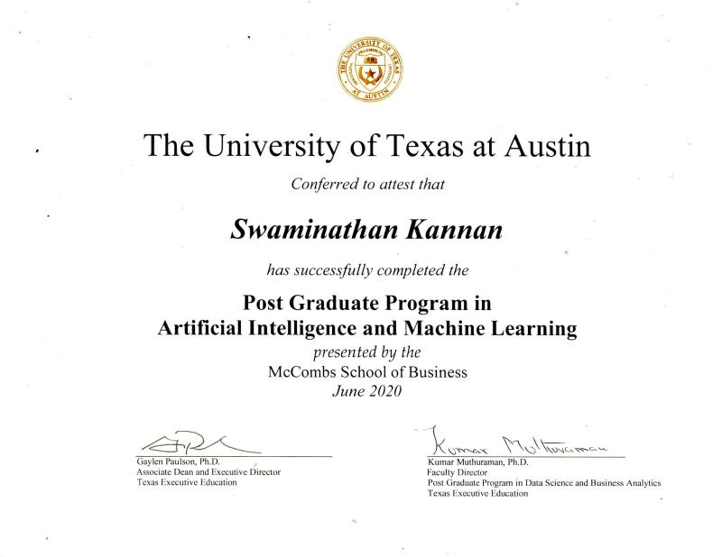
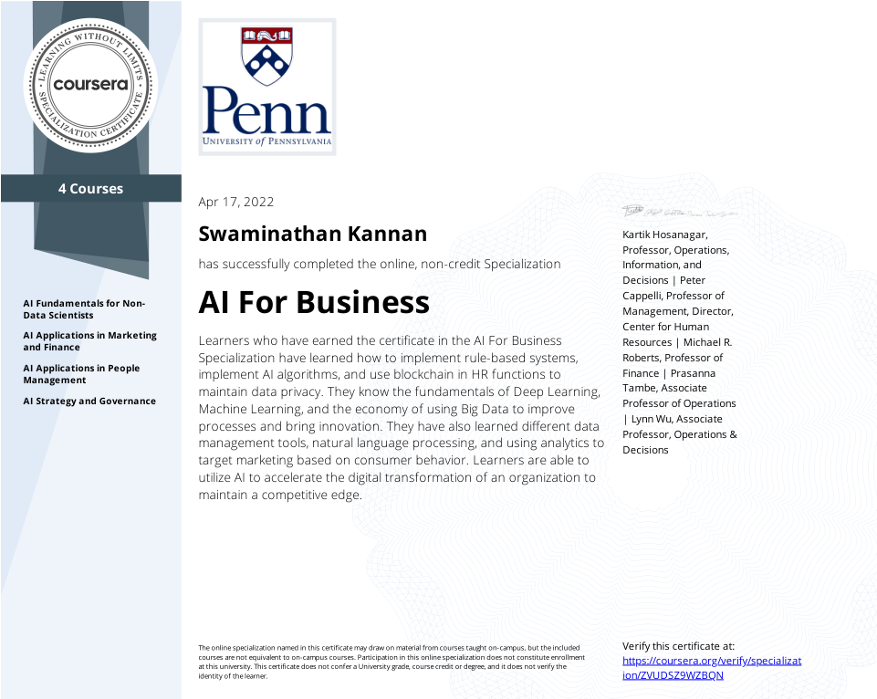
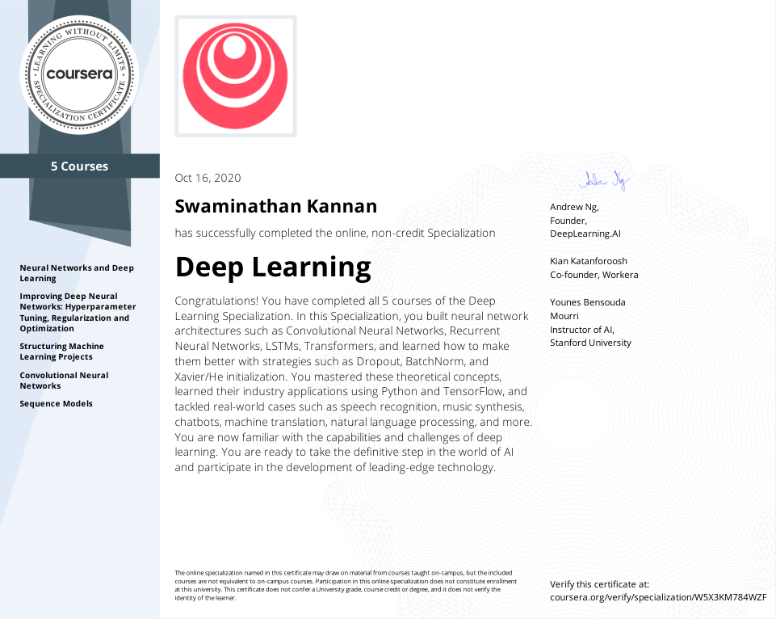

# Hi, I'm Swami 👋🏾

Over the past 13 years, I have worked across the developing world, travelling to interesting countries, meeting fantastic people and sharing their stories. Over this time, I began to really appreciate the power of technology and specifically, AI & ML in the professional world. This is my first step into a fantastic journey 
  
  

- 🌱 I’m currently exploring the HuggingFace library (transformers) and building agents for Atari games (Stable Baselines)
  

- ❓ Ask me about anything related to process optimization, operations and analytics  
  

- ⚡ Inspired by: Machines that better learn to represent the real-world, people that drive creativity and flow  
  

   

	

	

	

## Coursera / Udemy Specializations

<!-- Photo Grid -->

 
  

    
    
    
  

  

	
	
    
  
  
  

	
	
	
  

  

	
    
	
  

For all certificates, please go [here](https://github.com/SwamiKannan/Certifications)

## Connect with me  

  

  
  

   
 

